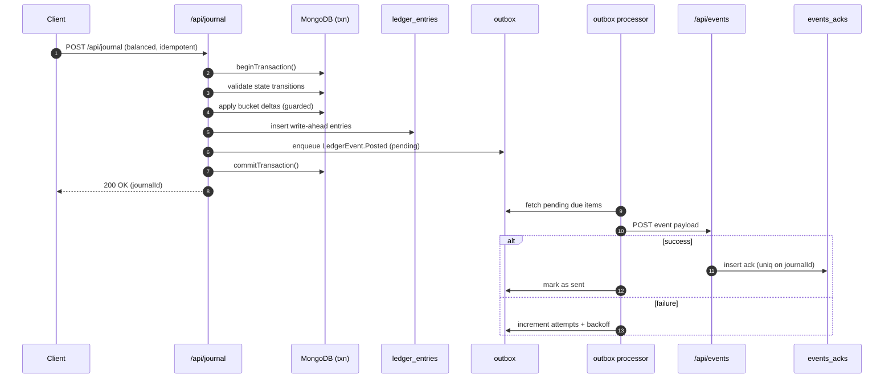

# Advanced Ledger Challenge

## Overview

This project implements a multi-entity transactional ledger that maintains strict consistency across multiple accounts and supports multi-step state transitions, idempotent journals, and event-driven outbox dispatch with retries.

It demonstrates an architecture suitable for financial systems, ensuring correctness even under partial failures, retries, and network interruptions.  

The implementation includes full test coverage (journal posting, state transitions, outbox processing, and health monitoring).

---

## Features & Objectives

### Core Objectives
- **Multi-step transitions** (`reserve -> lock -> finalize`, and `release -> revert`)
- **Strong consistency** across multiple accounts and journals
- **Atomic cross-account updates** using MongoDB transactions
- **Event-driven outbox dispatch** with retry and exponential backoff
- **Idempotency** to prevent double-reserves
- **Chaos mode** for simulating network failures
- **Observability** with structured logs, metrics, and health checks

---

## State Machine & Transitions

Each ledger journal line describes a **state transition** on an account bucket.

| Transition | From -> To            | Description                                   |
|------------|----------------------|------------------------------------------------|
| `reserve`  | available -> pending  | Hold funds for a potential transaction        |
| `lock`     | pending -> escrow     | Move held funds to system-controlled escrow   |
| `finalize` | escrow -> outflow     | Complete payout / reduce liability            |
| `release`  | pending -> available  | Cancel hold and restore availability          |
| `revert`   | escrow -> available   | Cancel escrow and restore availability        |

Transitions are strictly validated by `src/domain/stateMachine.ts`.

---

## API Endpoints

### POST `/api/journal`

Posts a new journal entry.

**Sample Request**
```json
{
  "journalId": "J23456",
  "idempotencyKey": "unique-key-999",
  "lines": [
    {
      "accountId": "USER_1",
      "fromBucket": "available",
      "toBucket": "pending",
      "side": "debit",
      "amount": { "currency": "USD", "amount": "150" },
      "transition": "reserve"
    },
    {
      "accountId": "ESCROW_POOL",
      "fromBucket": "available",
      "toBucket": "escrow",
      "side": "credit",
      "amount": { "currency": "USD", "amount": "150" },
      "transition": "lock"
    }
  ]
}
````

**Behavior**

* Validates transitions against the state machine
* Ensures the journal is **balanced** (total debit == total credit)
* Enforces **idempotency** via `idempotencyKey`
* Performs atomic MongoDB transaction updates
* Writes entries to `ledger_entries` (write-ahead log)
* Enqueues a **LedgerEvent.Posted** in the outbox for async dispatch

---

### GET `/api/accounts/:id/history`

Returns all transitions for a given account.

**Sample Response**

```json
{
  "accountId": "USER_1",
  "currency": "USD",
  "history": [
    { "transition": "reserve", "amount": "150", "timestamp": "2025-11-02T12:00:00Z" },
    { "transition": "lock", "amount": "150", "timestamp": "2025-11-02T12:01:00Z" },
    { "transition": "finalize", "amount": "150", "timestamp": "2025-11-02T12:05:00Z" }
  ]
}
```

---

### POST `/api/events`

Mock endpoint for event dispatch acknowledgements.
Ensures **exactly-once semantics** by inserting an `events_acks` record per journal. Duplicates are safely ignored.

---

### GET `/api/health`

Health check and observability endpoint.

**Sample Response**

```json
{
  "dbConnected": true,
  "outboxQueue": 2,
  "pendingRetries": 1,
  "metrics": {
    "ledger_journal_total": { "ok": 10, "fail": 1 },
    "ledger_outbox_retries_total": { "success": 8, "retry": 2 }
  },
  "timestamp": "2025-11-02T12:00:00Z"
}
```

---

## Outbox Processor

The outbox pattern guarantees reliable, exactly-once event delivery even in case of transaction or network failures.

**Behavior**

* Scans for due items (`status: pending`, `nextAttemptAt ≤ now`)
* Dispatches events to `/api/events`
* Retries on failures with **exponential backoff**
* Marks items as `sent` on success
* Records metrics for successes and retries

**CLI / Background Runner**

```bash
npm run outbox:process
```

---

## Chaos Mode

A chaos simulation is implemented via the `CHAOS_PROB` environment variable.

* Randomly throws errors during journal transactions
* Ensures atomic rollback and recovery on retry
* Demonstrated in tests (`J-CHAOS-1`)

Example:

```bash
CHAOS_PROB=0.5 npm test
```

---

## Observability

Every operation emits:

* **Structured logs** including `txId`, `idempotencyKey`, and `transition`
* **Metrics counters**:

    * `ledger_journal_total{status="ok|fail"}`
    * `ledger_outbox_retries_total{result="success|retry"}`

The `/api/health` endpoint aggregates and reports key metrics.

---

## Database Seeding (Demo Data)

Before testing the API endpoints, you can populate the database with demo accounts using the built-in seed script.

### Run the seed command

```bash
npm run seed
```

This command connects to the MongoDB instance and inserts the following accounts:

| Account ID       | Currency | Buckets (available/pending/escrow/outflow) |
| ---------------- | -------- | ------------------------------------------ |
| `USER_1`         | USD      | 200 / 0 / 0 / 0                            |
| `ESCROW_POOL`    | USD      | 200 / 0 / 0 / 0                            |
| `SYSTEM_OUTFLOW` | USD      | 0 / 0 / 0 / 0                              |

### Purpose

This provides initial balances, so you can immediately test the full journal transition flow:

```
reserve → lock → finalize
release → revert
```

## Quick Demo

Below are simple `curl` commands to try the flow locally (assuming `npm run dev` is running and MongoDB is available).

### 1) Reserve + Lock

```bash
curl -X POST http://localhost:3000/journal \
  -H "Content-Type: application/json" \
  -H "X-API-Key: <YOUR_API_KEY>" \
  -d '{
    "journalId": "J-DEMO-1",
    "idempotencyKey": "idem-demo-1",
    "lines": [
      { "accountId": "USER_1", "fromBucket": "available", "toBucket": "pending", "side": "debit", "amount": { "currency": "USD", "amount": "50" }, "transition": "reserve" },
      { "accountId": "ESCROW_POOL", "fromBucket": "available", "toBucket": "escrow", "side": "credit", "amount": { "currency": "USD", "amount": "50" }, "transition": "lock" }
    ]
  }'
```

### 2) Finalize

```bash
curl -X POST http://localhost:3000/journal \
  -H "Content-Type: application/json" \
  -H "X-API-Key: <YOUR_API_KEY>" \
  -d '{
    "journalId": "J-DEMO-2",
    "idempotencyKey": "idem-demo-2",
    "lines": [
      { "accountId": "ESCROW_POOL", "fromBucket": "escrow", "toBucket": "outflow", "side": "credit", "amount": { "currency": "USD", "amount": "50" }, "transition": "finalize" },
      { "accountId": "SYSTEM_OUTFLOW", "fromBucket": "available", "toBucket": "available", "side": "debit", "amount": { "currency": "USD", "amount": "50" }, "transition": "finalize" }
    ]
  }'
```

### 3) Check History

```bash
curl -s http://localhost:3000/accounts/USER_1/history \
  -H "X-API-Key: <YOUR_API_KEY>" | jq .
```

### 4) Run Outbox Processor

```bash
npm run outbox:process
```

### 5) Health

```bash
curl -s http://localhost:3000/health \
  -H "X-API-Key: <YOUR_API_KEY>" | jq .
```

---

## Architecture Diagram



---

## Running the Project

### 1) Prerequisites

* Node.js >= 18
* npm >= 9
* MongoDB

### 2) Installation

```bash
git clone https://github.com/lpinkhard/advanced-ledger-challenge.git
cd advanced-ledger-challenge
npm install
```

### 3) Local Dev

```bash
npm run dev
```

**.env**

```
MONGODB_URI="mongodb://localhost:27017/ledger"
DB_NAME="ledger"
API_KEY="12345678"
CHAOS_PROB="0.05"
OUTBOX_TARGET="/events"
```

### 4) Tests

```bash
npm test
```

Covers:

* Journal posting & idempotency
* State machine transitions
* Outbox + retries/backoff
* Chaos rollback & recovery
* Health endpoint

## Folder Structure

```
src/
 ├─ api/                # Route handlers (journal, events, health)
 ├─ domain/             # Core business logic & state machine
 ├─ services/           # Journal/outbox/health services
 ├─ lib/                # Database setup and helpers
 └─ tests/              # Vitest test suites
```

---

## Alignment with Challenge Requirements

| Requirement                                                                 | Implemented                         |
| --------------------------------------------------------------------------- |-------------------------------------|
| Multi-step transitions (`reserve`, `lock`, `finalize`, `release`, `revert`) | `stateMachine.ts`                 |
| Atomic transactions                                                         | MongoDB sessions                  |
| Idempotent journals                                                         | `idempotencyKey` & unique indexes |
| Write-ahead ledger entries                                                  | `ledger_entries`                  |
| Outbox dispatch + retry/backoff                                             | `processOutbox`                   |
| Exactly-once event delivery                                                 | `/api/events` + `events_acks`     |
| Chaos/failure simulation                                                    | `CHAOS_PROB`                      |
| Observability & metrics                                                     | `/api/health`                     |
| End-to-end tests                                                            | `tests/*.spec.ts`                 |

---
